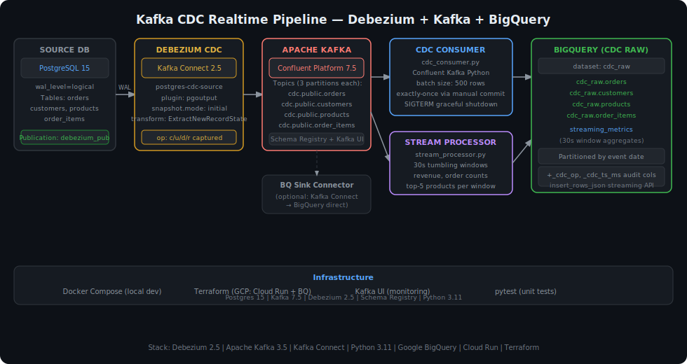

# Kafka CDC Realtime Pipeline


Production-grade Change Data Capture pipeline that streams every INSERT, UPDATE, and DELETE from a PostgreSQL e-commerce database into BigQuery in near real-time using Debezium, Apache Kafka, and Python consumers — with sub-second latency on the Kafka path and 30-second micro-batch windows for real-time aggregations.

## Architecture



## How It Works

```
PostgreSQL (WAL logical replication)
   └── Debezium Kafka Connect (CDC source connector)
         └── Apache Kafka topics  (cdc.public.orders / customers / products / order_items)
               ├── cdc_consumer.py   → BigQuery streaming insert (per-table, batch=500)
               └── stream_processor.py → 30s tumbling windows → BigQuery streaming_metrics
```

## Key Features

**Debezium CDC Source**
- Reads PostgreSQL WAL via `pgoutput` plugin — zero-impact on the source database.
- Captures `c` (create), `u` (update), `d` (delete), and `r` (snapshot read) operations.
- `ExtractNewRecordState` transform flattens the Debezium envelope; adds `__op`, `__source_table`, `__source_ts_ms` fields.

**Python CDC Consumer**
- Batch-commits Kafka offsets only after a successful BigQuery `insert_rows_json` call — guarantees at-least-once delivery.
- Appends `_cdc_op` and `_cdc_ts_ms` audit columns to every BigQuery row.
- Handles SIGTERM gracefully: flushes remaining batch before exiting.

**Stream Processor**
- Maintains in-memory rolling window (default 30 s) over the `orders` topic.
- Emits: total revenue, order count, top-5 products, per-channel revenue breakdown.
- Writes to `cdc_raw.streaming_metrics` — ideal for live dashboards.

## Project Structure

```
kafka-cdc-realtime-pipeline/
├── consumers/
│   ├── cdc_consumer.py          # CDC event consumer → BigQuery
│   └── stream_processor.py      # 30s rolling window aggregator
├── kafka/
│   └── connectors/
│       ├── postgres-cdc-connector.json   # Debezium source config
│       └── bigquery-sink-connector.json  # BQ sink connector config
├── docker/
│   ├── docker-compose.yml       # Full local stack
│   ├── Dockerfile
│   └── init.sql                 # Postgres schema + CDC publication
├── terraform/
│   └── main.tf                  # BQ dataset, Cloud Run, IAM
├── tests/
│   ├── test_cdc_consumer.py
│   └── test_stream_processor.py
├── snapshots/
│   └── architecture.svg
├── .env.example
└── requirements.txt
```

## Quick Start

```bash
# 1. Clone + install
git clone https://github.com/jaiminbabariya7/kafka-cdc-realtime-pipeline.git
cd kafka-cdc-realtime-pipeline
pip install -r requirements.txt

# 2. Configure environment
cp .env.example .env  # Fill in credentials

# 3. Start the full local stack
cd docker && docker-compose up -d

# 4. Register the Debezium connector (wait ~30s for Kafka Connect to start)
curl -X POST http://localhost:8083/connectors \
  -H "Content-Type: application/json" \
  -d @kafka/connectors/postgres-cdc-connector.json

# 5. Run the consumers (in separate terminals)
python consumers/cdc_consumer.py --tables orders,customers,products,order_items
python consumers/stream_processor.py

# 6. Run tests
pytest tests/ -v --cov=consumers

# 7. Deploy to GCP
cd terraform && terraform init && terraform apply -var="project_id=$GCP_PROJECT_ID"
```

## Tech Stack

| Component | Technology |
|---|---|
| CDC Source | Debezium 2.5 (PostgreSQL connector) |
| Message Broker | Apache Kafka 3.5 (Confluent Platform) |
| Consumers | Python 3.11 + confluent-kafka |
| Sink | Google BigQuery (streaming insert API) |
| Infrastructure | Terraform + Cloud Run |
| Local Dev | Docker Compose |
| Testing | pytest |
| Monitoring | Kafka UI |